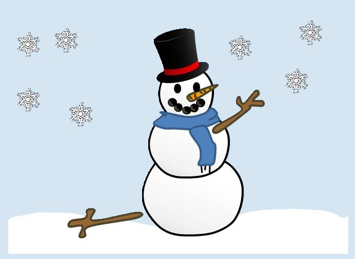
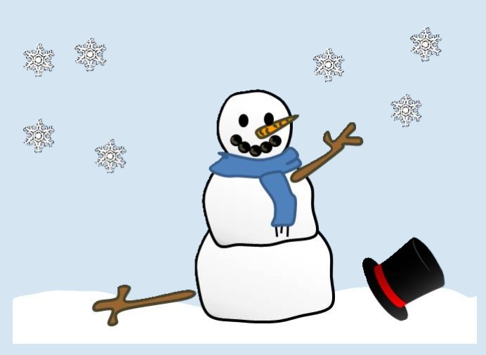
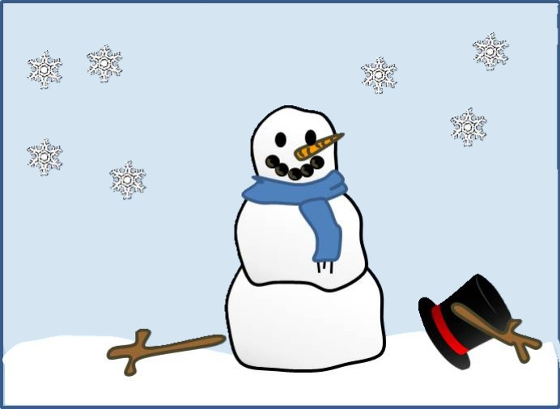
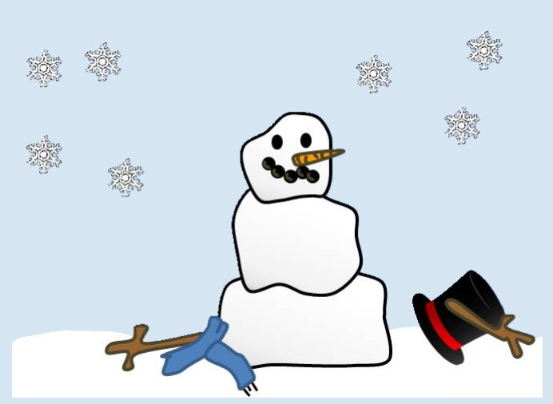
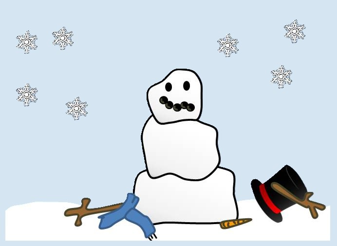
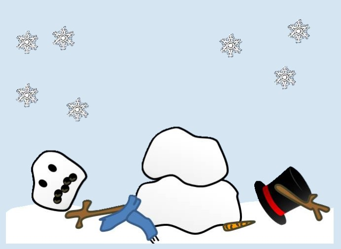
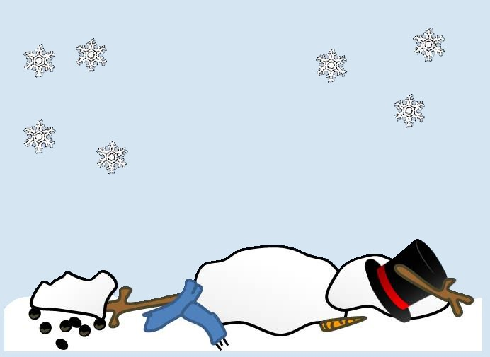

                         Snowman Game

The name of my game is called Snowman. 

My game uses, HTML, CSS and Javascript programing to randomly select a hidden word and allow a player to guess letters with a limit of 8 lives.  If a guessed letter appears in the word, the letter is revealed, if not, the player loses a life and part of the snowman melts.  The goal of the game is to guess the word before running out of lives.

The snowman game is very similar to the hangman game and I chose this as an alternative to the hangman game this is to enable younger kids to enjoy the benefits of playing a word guessing game without it being offensive. 

Getting started: Include a link to your deployed game and any instructions you deem important:

 This should also contain a link to your planning materials.
Attributions: This section should include links to any external resources (such as libraries or assets) you used to develop your application that require attribution. You can exclude this section if it does not apply to your application.

Planned future enhancements:
Playing audio in back ground of game
Playing audio when a button is clicked
Creating a hint button
Creating a modal

Imported font:
'https://fonts.googleapis.com/css2?family=Grandstander:ital,wght@0,100..900;1,100..900&display=swap'

Images;

Project planning link: <https://excalidraw.com/#json=cszQ6SkFcWqddHH7d2jxT,62Ei3A7Tg_mL7tsCn5vX9A>
GitHub repo link: <https://github.com/anneAC84/Snowman.git>
Deployed project link:

